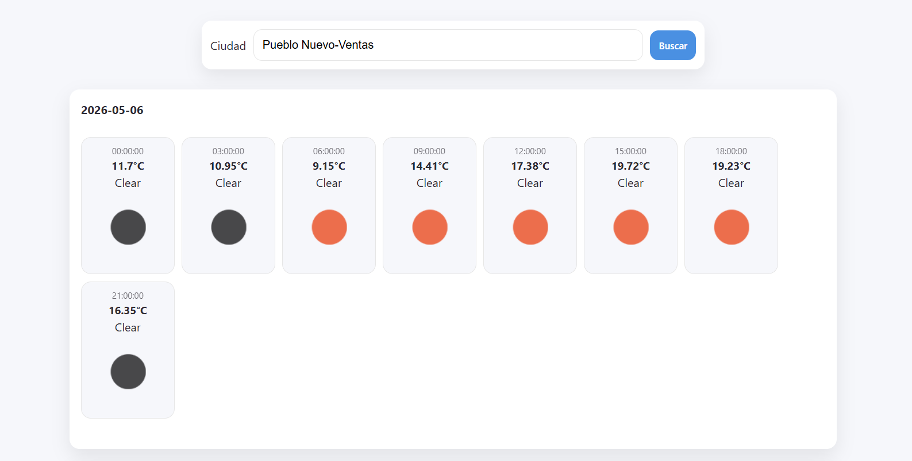

# 🌤️ Weather Info App

## 🌐 Live Demo

https://weather-info-karina-dev.netlify.app



---

## 📌 Descripción

Weather Info App es una aplicación desarrollada con **React + Vite** que permite consultar el pronóstico del tiempo de diferentes ciudades utilizando la API de Weather (5-day / 3-hour forecast).

La aplicación está construida con una arquitectura basada en componentes reutilizables y gestión de estado con `useEffect` para manejar peticiones asíncronas.

---

## ⚙️ Funcionalidades

* 🔎 Búsqueda de ciudades mediante formulario
* 🌤️ Visualización del pronóstico extendido por días
* ⏱️ Información horaria del clima (temperatura, estado del tiempo como: clear, clouds, rain)
* 🖼️ Iconos representativos del clima
* 📍 Ciudad por defecto: Madrid
* 🌍 Actualización dinámica al buscar una nueva ciudad
* 📱 Diseño completamente responsive (mobile-first)

---

## ✨ Extras implementados

* 📍 Geolocalización del usuario en la primera carga (sustituye Madrid)
* 🖼️ Imágenes representativas del estado del clima
* 🧩 Componentes modulares y reutilizables
* 🎯 Uso de UUID para keys únicas en listas

---

## 🧱 Estructura del proyecto

```
src/
│
├── components/
│   ├── SearchForm/
│   │   ├── SearchForm.jsx
│   │   └── SearchForm.module.css
│   │
│   ├── WeatherList/
│   │   ├── WeatherList.jsx
│   │   └── WeatherList.module.css
│   │
│   └── WeatherCard/
│       ├── WeatherCard.jsx
│       └── WeatherCard.module.css
│
├── App.jsx
├── main.jsx
└── index.css
```

---

## 🚀 Instalación y ejecución

### 1. Clonar el repositorio

```bash
git clone <URL_DEL_REPO>
```

### 2. Entrar en el proyecto

```bash
cd weather-info-app
```

### 3. Instalar dependencias

```bash
npm install
```

---

## 📦 Dependencias necesarias

```bash
npm install uuid
```

---

## 🔐 Variables de entorno (.env)

Crear un archivo `.env` en la raíz del proyecto:

```env
VITE_WEATHER_API_KEY=tu_api_key
```

Uso en el código:

```js
console.log(import.meta.env.VITE_WEATHER_API_KEY)
```

---

## 🌐 API utilizada

* OpenWeather 5 Day / 3 Hour Forecast API
  https://openweathermap.org/forecast5

---

## 📱 Responsive Design

La aplicación está desarrollada con enfoque **mobile-first**, adaptándose a:

* 📱 Móviles (320px+)
* 📟 Tablets (768px+)
* 💻 Escritorio (1024px+)

Incluye:

* Layout flexible
* Scroll horizontal en previsión por horas
* Cards adaptativas
* Espaciado dinámico según pantalla

---

## 🧠 Tecnologías utilizadas

* React
* Vite
* CSS Modules
* useEffect
* Fetch API
* UUID
* Geolocalización del navegador

---

## 👨‍💻 Autor

Proyecto desarrollado como práctica para reforzar:

* Manejo de useEffect
* Asincronía en React
* Consumo de APIs
* Arquitectura basada en componentes
* Diseño responsive
